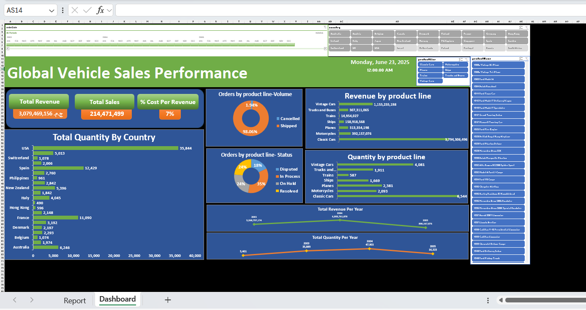

# Excel Dashboard Connected to MySQL

This project demonstrates a dynamic Excel dashboard that fetches real-time data from a MySQL database using Power Query and ODBC connection.

## Features:
- Live connection to MySQL
- Pivot tables, slicers, KPIs
- Real-time dashboard for sales and revenue

